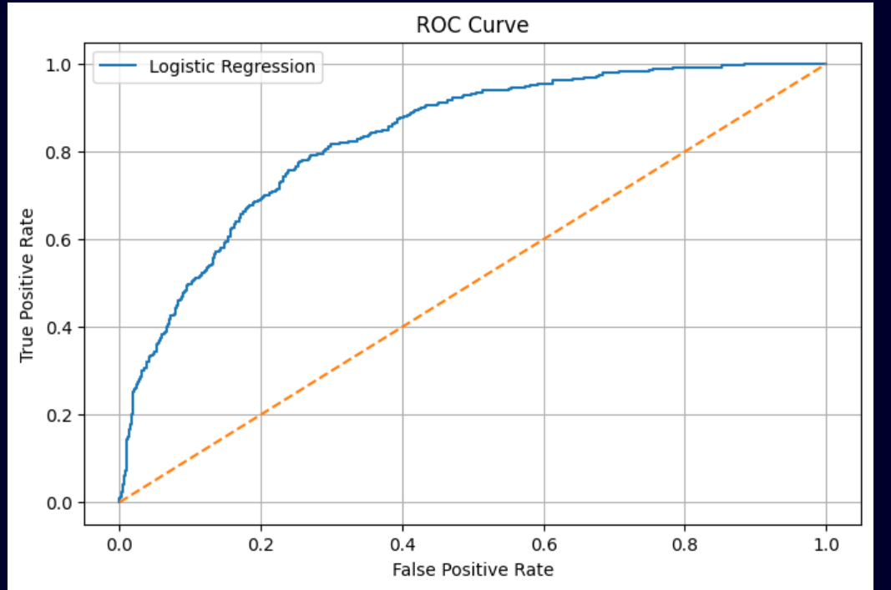
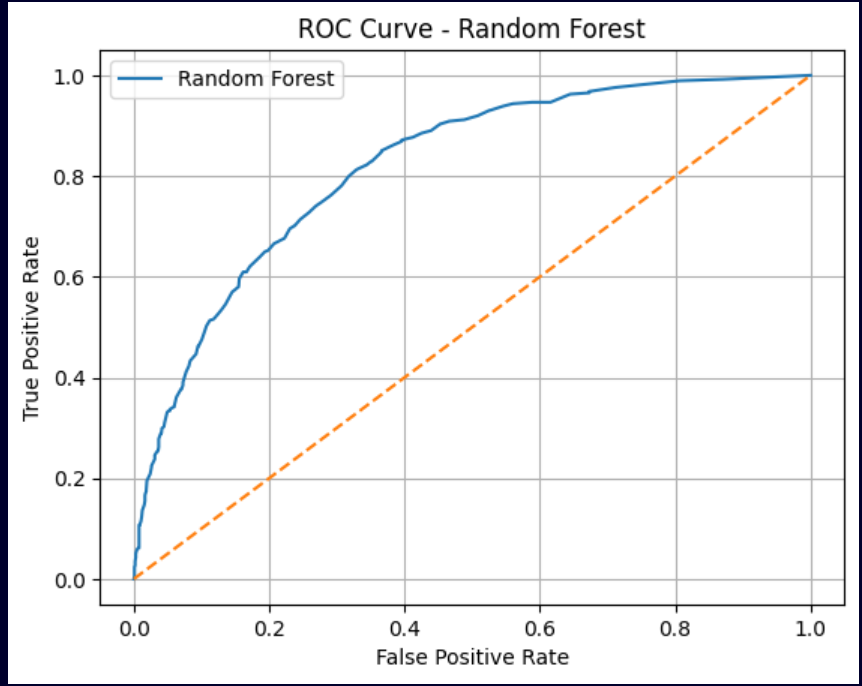
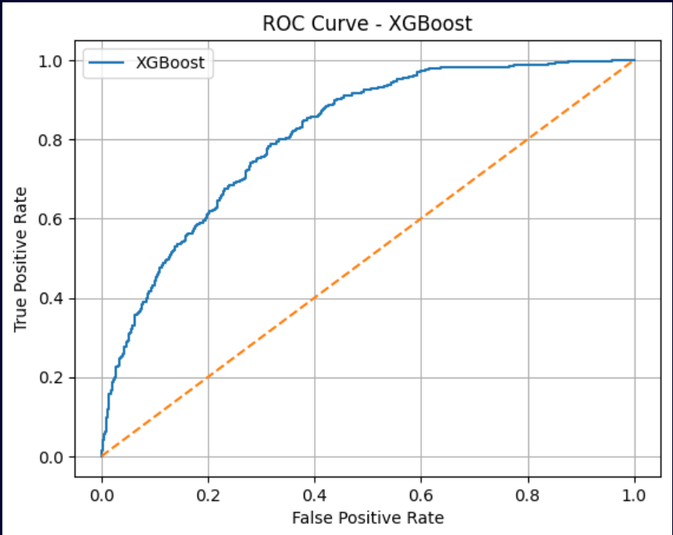

# 📉 Customer Churn Prediction System

This project is built for **Task 2** of the **Future Interns Machine Learning Internship**.  
The goal is to build a machine learning system that predicts **customer churn** — whether a customer is likely to stop using a service — using the **Telco Customer Churn** dataset.  

The system is presented via a clean, dynamic, and interactive **Streamlit** UI.

---

## 📌 Project Highlights

- 📊 Explored and trained on a real-world customer churn dataset
- 🧠 Implemented and compared **three ML models** (Logistic Regression, Random Forest, XGBoost)
- 🥇 Selected the best model using **ROC AUC Score**
- 💻 Developed a sleek **Streamlit app** for real-time churn prediction
- 📁 Organized clean modular folders for reproducibility and deployment

---

## 📁 Project Structure

| Folder/File              | Description                                      |
|--------------------------|--------------------------------------------------|
| `Data/`                  | Contains the Telco churn dataset (`.csv`)        |
| `Images/`                | ROC AUC curve screenshots (for all 3 models)     |
| `Notebooks/`             | Model training notebooks: LR, RF, XGB            |
| `saved_model/`           | Saved `.pkl` files: model, scaler, feature names |
| `churn_app.py`           | Final Streamlit UI for interactive prediction    |
| `requirements.txt`       | All required Python libraries                    |
| `README.md`              | Project documentation (this file)                |

---

## 🧠 Model Comparison & Results

| Model                | Accuracy | Churn Recall | ROC AUC |
|----------------------|----------|--------------|---------|
| **Logistic Regression** | 79%      | **52%**       | **0.832** ✅ |
| Random Forest        | 79%      | 48%          | 0.818   |
| XGBoost              | 77%      | 50%          | 0.811   |

> 📌 **Logistic Regression** had the best balance of performance and interpretability, so it was chosen for the final Streamlit app.

---

## 📸 Visuals – ROC Curves

### 🔹 Logistic Regression


### 🔹 Random Forest


### 🔹 XGBoost


---

## 💻 Streamlit UI Overview

- Clean and responsive layout using Streamlit's column structure
- Inputs include customer contract type, monthly charges, tenure, etc.
- Realtime churn prediction using the Logistic Regression model
- Confidence level shown with a visual progress bar

To run locally:
```bash
pip install -r requirements.txt
streamlit run churn_app.py
